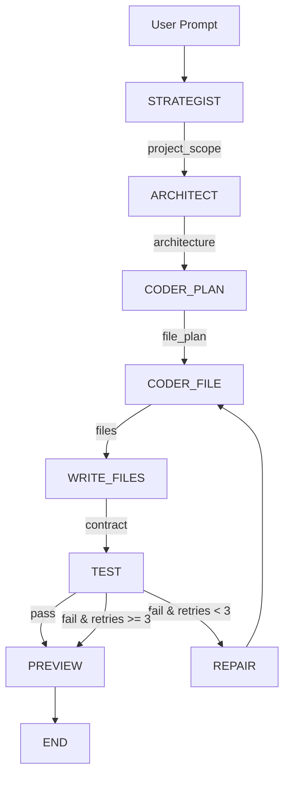
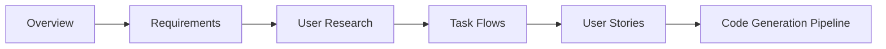
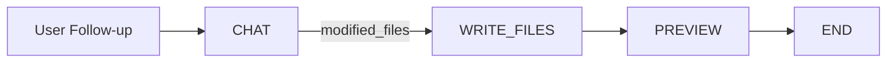

# 🏭 AI Code Factory — A-Team Platform

> An AI-powered full-stack application generator that transforms natural language descriptions into production-ready web applications — complete with SDLC planning, multi-agent code generation, automated testing, self-healing, and live preview.

[](https://python.org)
[](https://react.dev)
[](https://github.com/langchain-ai/langgraph)
[](https://flask.palletsprojects.com)
[](LICENSE)

---

## 🎯 What It Does

Given a simple prompt like:
> *"build a todo app where I can add, complete, and delete tasks"*

The platform automatically orchestrates a **multi-agent AI pipeline** that:

| Phase | What Happens |
|-------|-------------|
| 📋 **SDLC Planning** | 5-stage planning: Overview → Requirements → User Research → Task Flows → User Stories |
| 🧠 **Strategy** | Strategist Agent analyzes requirements, defines scope, pages, data models, and API endpoints |
| 📐 **Architecture** | Architect Agent designs the system architecture — backend routes, frontend components |
| 🔨 **Code Generation** | Coder Agent generates complete Flask backend + React frontend files |
| ✅ **Testing** | Automated contract tests validate API endpoints |
| 🔧 **Self-Healing** | Repair Agent fixes failing tests (up to 3 retry attempts) |
| 🌐 **Live Preview** | Starts Flask + Vite servers and opens the running app in your browser |

---

## 🖼️ Platform Overview

### Two-Mode Architecture

The platform operates in **two modes**:

1. **Web IDE Mode** (`web_ui.py`) — A full-featured browser-based IDE with:
   - 💬 Chat panel for natural language interaction
   - 📁 File explorer with syntax-highlighted code editor (Monaco)
   - 🌐 Live preview panel with embedded iframe
   - 📊 Real-time SSE progress streaming
   - 💾 Project persistence (SQLite database)
   - 🔄 Version history with snapshot restore

2. **CLI Mode** (`run_factory.py`) — Direct command-line execution for quick generation.

---

## 🚀 Quick Start

### Prerequisites

| Dependency | Version | Purpose |
|-----------|---------|---------|
| Python | 3.10+ | Backend runtime |
| Node.js | 18+ | Frontend build & preview |
| npm | 9+ | Package management |

### 1. Clone & Install

```bash
git clone https://github.com/Raj280502/a-team-platform.git
cd a-team-platform

# Create virtual environment
python -m venv .venv
.venv\Scripts\activate        # Windows
# source .venv/bin/activate   # macOS/Linux

# Install Python dependencies
pip install -r requirements.txt

# Install client (React UI) dependencies
cd client
npm install
cd ..
```

### 2. Configure API Keys

Create a `.env` file in the project root:

```env
# Required: At least one LLM provider
GROQ_API_KEY=your_groq_api_key_here

# Optional: Google Gemini as fallback / SDLC provider
GOOGLE_API_KEY=your_google_api_key_here

# Optional: Hugging Face (for local models, not used by default)
HF_API_KEY=your_hf_api_key_here

# LLM Provider Selection
LLM_PROVIDER=groq                     # groq | gemini
GROQ_MODEL=llama-3.3-70b-versatile    # Primary model for code gen
SDLC_LLM_PROVIDER=groq                # groq | gemini (for planning stages)
SDLC_GROQ_MODEL=llama-3.1-8b-instant  # Smaller model for SDLC stages
```

> **Free API keys:**
> - Groq: [console.groq.com](https://console.groq.com)
> - Google Gemini: [aistudio.google.com/apikey](https://aistudio.google.com/apikey)

### 3. Run the Platform

#### Option A: Web IDE (Recommended)

```bash
# Terminal 1: Start the backend (Flask on port 8080)
python web_ui.py

# Terminal 2: Start the frontend dev server (Vite on port 3000)
cd client
npm run dev
```

Open **http://localhost:3000** in your browser.

#### Option B: Quick Launch (Windows)

```bash
start_web_ui.bat
```

#### Option C: CLI Mode

```bash
# Interactive
python run_factory.py

# One-shot
python run_factory.py "build a recipe book app"
```

---

## 📁 Project Structure

```
a-team-platform/
│
├── 📄 web_ui.py                      # Flask web server (port 8080) — API + serves React build
├── 📄 run_factory.py                  # CLI entry point
├── 📄 requirements.txt               # Python dependencies
├── 📄 start_web_ui.bat               # Windows quick launcher
├── 📄 .env                           # API keys and configuration
│
├── 📂 app/                           # Backend Python application
│   ├── 📄 main.py                    # Pipeline orchestrator (invoke / streaming / chat)
│   │
│   ├── 📂 core/                      # Core infrastructure
│   │   ├── config.py                 # Environment config, model selection, token limits
│   │   ├── llm.py                    # Multi-provider LLM (Groq ↔ Gemini) with auto-fallback
│   │   ├── state.py                  # ProjectState TypedDict — shared pipeline memory
│   │   └── database.py               # SQLite persistence (projects, files, messages, versions)
│   │
│   ├── 📂 agents/                    # AI agent definitions (prompts + schemas)
│   │   ├── 📂 strategist/            # Requirement analysis & scope definition
│   │   │   ├── prompt.py             # System prompt for extracting features, pages, APIs
│   │   │   ├── schema.py             # Pydantic output schema
│   │   │   └── node.py               # LangGraph node wrapper
│   │   ├── 📂 architect/             # System design & component architecture
│   │   │   ├── prompt.py             # Architecture design prompt
│   │   │   ├── schema.py             # Architecture output schema
│   │   │   └── node.py               # LangGraph node wrapper
│   │   ├── 📂 coder/                 # Code generation & repair
│   │   │   ├── prompt.py             # Generation + repair prompts
│   │   │   ├── schema.py             # File output schema
│   │   │   └── node.py               # LangGraph node wrapper
│   │   ├── 📂 tester/                # Test result processing
│   │   │   ├── schema.py             # Test result schema
│   │   │   └── node.py               # LangGraph node wrapper
│   │   └── 📂 sdlc/                  # SDLC planning stage schemas
│   │       └── schemas.py            # Pydantic models for all 5 SDLC stages
│   │
│   ├── 📂 graph/                     # LangGraph workflow orchestration
│   │   ├── graph.py                  # Graph definitions (generation, chat, SDLC)
│   │   ├── edges.py                  # Conditional edges (repair loop logic)
│   │   └── 📂 nodes/                 # All pipeline node implementations
│   │       ├── strategist_node.py    # Phase 1: Analyze requirements
│   │       ├── architect_node.py     # Phase 1: Design architecture
│   │       ├── coder_plan_node.py    # Phase 2: Plan files to generate
│   │       ├── coder_file_node.py    # Phase 2: Generate individual files
│   │       ├── write_files_node.py   # Phase 2: Write to disk + create API contract
│   │       ├── test_node.py          # Phase 3: Run contract tests
│   │       ├── repair_node.py        # Phase 4: Auto-fix failing code
│   │       ├── preview_node.py       # Phase 5: Start Flask + Vite for live preview
│   │       ├── chat_node.py          # Chat: Iterative refinement of existing projects
│   │       ├── overview_node.py      # SDLC Stage 1: Project Overview
│   │       ├── requirements_node.py  # SDLC Stage 2: Requirements
│   │       ├── user_research_node.py # SDLC Stage 3: User Research & Personas
│   │       ├── task_flows_node.py    # SDLC Stage 4: Task Flows & User Journeys
│   │       ├── user_stories_node.py  # SDLC Stage 5: User Stories & Sprints
│   │       ├── end_node.py           # Terminal node
│   │       ├── docker_node.py        # Docker scaffold (experimental)
│   │       ├── docker_scaffold_node.py # Docker config generation
│   │       ├── contract_designer_node.py
│   │       ├── contract_verify_node.py
│   │       └── generate_node.py
│   │
│   ├── 📂 contracts/                 # API contract testing schema
│   │   └── schema.py                 # BackendContract Pydantic model
│   │
│   ├── 📂 runtime/                   # Preview & testing infrastructure
│   │   ├── preview.py                # Preview server management
│   │   ├── contract_tester.py        # Contract-based API testing
│   │   ├── test_runner.py            # Backend server management for tests
│   │   ├── runner.py                 # Process runner utility
│   │   ├── failure_compiler.py       # Compile test failures into repair prompts
│   │   └── 📂 docker/               # Docker configuration (experimental)
│   │
│   ├── 📂 utils/                     # Shared utilities
│   │   ├── file_ops.py               # File I/O helpers (write, normalize code)
│   │   ├── code_validator.py         # Code validation and linting
│   │   ├── llm_output_parser.py      # Parse/sanitize LLM JSON output
│   │   ├── json_sanitizer.py         # Fix malformed JSON from LLM
│   │   └── patch_sanitizer.py        # Sanitize code patches
│   │
│   └── 📂 workspace/                 # Generated project output
│       ├── generated_projects/       # Each generated project lives here
│       └── projects.db               # SQLite database for project persistence
│
└── 📂 client/                        # React + Vite frontend (Web IDE)
    ├── 📄 package.json               # npm dependencies
    ├── 📄 vite.config.js             # Vite dev server config (proxy → Flask 8080)
    ├── 📄 index.html                 # SPA entry point
    │
    └── 📂 src/
        ├── 📄 main.jsx               # React root (BrowserRouter)
        ├── 📄 App.jsx                # Route definitions (Projects, Editor)
        ├── 📄 App.css                # Global app styles
        ├── 📄 index.css              # Base CSS reset & theme variables
        │
        ├── 📂 components/            # Reusable UI components
        │   ├── ChatPanel.jsx/.css    # Chat input/output panel
        │   ├── CodePanel.jsx/.css    # File tree + Monaco code editor
        │   ├── EditorPane.jsx/.css   # Syntax-highlighted code viewer
        │   ├── FileTree.jsx/.css     # File explorer sidebar
        │   ├── Header.jsx/.css       # Top navigation bar
        │   ├── PreviewPanel.jsx/.css  # Live preview iframe
        │   ├── ResizeHandle.jsx/.css  # Draggable panel resizer
        │   ├── StageSidebar.jsx/.css  # SDLC stage navigation sidebar
        │   ├── StatusBar.jsx/.css     # Bottom status bar
        │   └── VersionHistory.jsx/.css # Version history panel
        │
        ├── 📂 pages/                 # Page-level components
        │   ├── ProjectsPage.jsx/.css # Project list / dashboard
        │   └── 📂 stages/           # SDLC stage detail pages
        │       ├── StagePages.css    # Shared SDLC stage styles
        │       ├── OverviewPage.jsx  # Stage 1: Project Overview
        │       ├── RequirementsPage.jsx # Stage 2: Requirements (FR/NFR)
        │       ├── UserResearchPage.jsx # Stage 3: Personas & Empathy Maps
        │       ├── TaskFlowsPage.jsx # Stage 4: Task Flows (visual diagrams)
        │       └── UserStoriesPage.jsx # Stage 5: Epics, Sprints & Stories
        │
        └── 📂 hooks/
            └── useGeneration.js      # Custom hook: SSE streaming, files, preview state
```

---

## 🔄 Pipeline Flow

### Code Generation Pipeline



### SDLC Planning Pipeline (Stage-Gated)



Each SDLC stage runs independently as a single-node LangGraph. The user reviews and approves each stage before proceeding.

### Chat Refinement Pipeline



---

## 🤖 AI Models & Providers

The platform uses a **multi-provider LLM system** with automatic fallback:

| Component | Primary Provider | Model | Fallback |
|-----------|-----------------|-------|----------|
| **Strategist** | Groq | `llama-3.3-70b-versatile` | Google Gemini |
| **Architect** | Groq | `llama-3.3-70b-versatile` | Google Gemini |
| **Coder** | Groq | `llama-3.3-70b-versatile` | Google Gemini |
| **Repair** | Groq | `llama-3.3-70b-versatile` | Google Gemini |
| **SDLC Stages** | Groq | `llama-3.1-8b-instant` | Google Gemini |
| **Chat** | Groq | `llama-3.3-70b-versatile` | Google Gemini |

### Resilience Features

- **Auto-fallback**: If primary provider hits rate limits → automatically tries fallback
- **Retry with backoff**: If both providers are busy → waits and retries (up to 2 retries)
- **Role-based caching**: LLM instances are cached per role for performance
- **SDLC uses cheaper models**: Planning stages use smaller/faster models to avoid rate limits

---

## 🌐 API Reference

### REST Endpoints (Flask — port 8080)

| Method | Path | Description |
|--------|------|-------------|
| `GET` | `/api/status` | Current generation status |
| `POST` | `/api/generate` | Start new project generation |
| `POST` | `/api/chat` | Send follow-up modification |
| `GET` | `/api/files` | Get all generated files |
| `GET` | `/api/file/<path>` | Get single file content |
| `PUT` | `/api/file/<path>` | Update file content |
| `GET` | `/api/download` | Download project as ZIP |
| `GET` | `/api/stream` | SSE event stream (real-time updates) |
| `GET` | `/api/logs` | Pipeline execution logs |

#### Project Management

| Method | Path | Description |
|--------|------|-------------|
| `GET` | `/api/projects` | List all projects |
| `GET` | `/api/projects/<id>` | Load project details |
| `DELETE` | `/api/projects/<id>` | Delete project |

#### SDLC Stages

| Method | Path | Description |
|--------|------|-------------|
| `GET` | `/api/stages` | All SDLC stage statuses |
| `GET` | `/api/stages/overview` | Stage completion summary |
| `GET` | `/api/stages/<name>` | Get specific stage data |
| `POST` | `/api/stages/run/<name>` | Run a specific SDLC stage |
| `POST` | `/api/stages/generate` | Trigger code generation after SDLC |

#### Preview Control

| Method | Path | Description |
|--------|------|-------------|
| `POST` | `/api/preview/start` | Start preview servers |
| `POST` | `/api/preview/stop` | Stop preview servers |
| `GET` | `/api/preview/status` | Check preview health |

### WebSocket Events (Socket.IO)

| Event | Direction | Description |
|-------|-----------|-------------|
| `connect` | Client → Server | Client connection |
| `generate` | Client → Server | Start generation via WS |
| `chat` | Client → Server | Chat refinement via WS |
| `status` | Server → Client | Step status updates |
| `generation_complete` | Server → Client | Generation finished |
| `generation_error` | Server → Client | Generation failed |
| `chat_complete` | Server → Client | Chat refinement done |

---

## 🗄️ Database Schema

SQLite database (`app/workspace/projects.db`) with 4 tables:

| Table | Purpose |
|-------|---------|
| `projects` | Project metadata (name, prompt, status, tech stack) |
| `generated_files` | Generated file contents (path → content) |
| `chat_messages` | Conversation history per project |
| `sdlc_stages` | SDLC stage outputs (JSON) per project |
| `project_versions` | File snapshots for version history |

---

## 🛠️ Generated Application Stack

Each generated project includes:

| Layer | Technology | Details |
|-------|-----------|---------|
| **Backend** | Flask (Python) | Single `app.py`, in-memory storage, CORS, RESTful API |
| **Frontend** | React 18 + Vite | Functional components, hooks, axios for API calls |
| **API** | RESTful JSON | Auto-generated endpoints with health check |
| **Testing** | Contract Tests | Auto-generated from Flask routes |

---

## 📝 Example Prompts

```
"build a todo app with add, complete, and delete features"
"create a calculator that can add, subtract, multiply, and divide"
"make a note-taking app where I can create, edit, and delete notes"
"build a simple expense tracker with categories"
"create a recipe book app with search by ingredient"
"make a contact list manager with favorites"
"build a kanban board with drag-and-drop"
"create a personal finance dashboard"
```

---

## ⚙️ Configuration Reference

All configuration is managed via environment variables (`.env`):

| Variable | Default | Description |
|----------|---------|-------------|
| `GROQ_API_KEY` | — | Groq API key (primary LLM) |
| `GOOGLE_API_KEY` | — | Google Gemini API key (fallback) |
| `HF_API_KEY` | — | Hugging Face API key (optional) |
| `LLM_PROVIDER` | `groq` | Primary LLM provider (`groq` \| `gemini`) |
| `GROQ_MODEL` | `llama-3.3-70b-versatile` | Model for code generation |
| `SDLC_LLM_PROVIDER` | `groq` | SDLC stage provider |
| `SDLC_GROQ_MODEL` | `llama-3.1-8b-instant` | Smaller model for planning |
| `SDLC_GEMINI_MODEL` | `gemini-2.5-flash` | Gemini model for SDLC |
| `WORKSPACE_DIR` | `app/workspace/generated_projects` | Output directory |
| `PREVIEW_BACKEND_PORT` | `5000` | Generated app backend port |
| `PREVIEW_FRONTEND_PORT` | `5173` | Generated app frontend port |

---

## 🐛 Troubleshooting

| Issue | Solution |
|-------|----------|
| **Groq rate limit** | Wait 30-60s or add `GOOGLE_API_KEY` for automatic fallback |
| **Preview won't start** | Ensure ports 5000/5173 are free; check Node.js is installed |
| **npm install fails** | Run `npm cache clean --force` and retry |
| **"No LLM provider"** | Ensure at least `GROQ_API_KEY` is set in `.env` |
| **Stale SDLC data** | The platform resets SDLC state when switching projects |
| **Missing imports in preview** | Auto-patched by `preview_node.py` — restart preview |

See [TROUBLESHOOTING.md](TROUBLESHOOTING.md) for detailed debugging guides.

---

## 📜 License

MIT License
